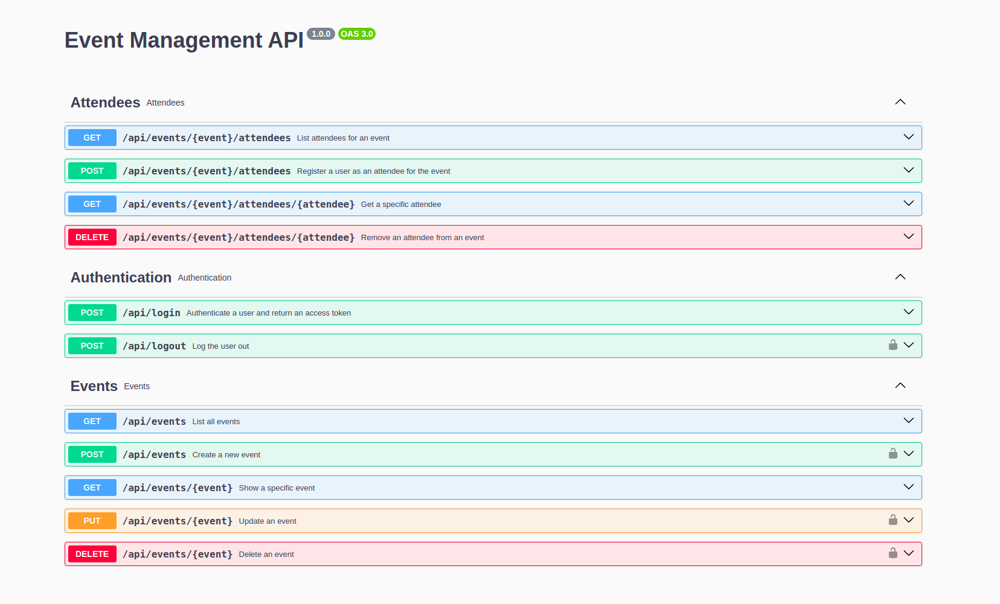

# Event Management API

A Laravel-based REST API for managing events and attendees with features focused on notifications, queueing, and a Docker-powered local development environment.



## 🚀 Features

* Rate limiting for all API routes.
* Queued email submission for scalable email sending.
* Email reminders sent to event attendees for events happening within the next 24 hours.
* A custom `php artisan` command that finds upcoming events and dispatches reminder emails.
* Scheduled execution of the reminder command (can run via a cron or container scheduler).
* Mailpit included to catch and inspect outgoing emails locally.
* Docker Compose setup to run MySQL, PHP (app), web server and Mailpit.
* Authorization using Laravel Policies.
* Authentication with Laravel Sanctum using user tokens.
* Resource controllers for `Event` and `Attendee` with API pagination.
* Swagger documentation for all API endpoints

---

## 🧰 Prerequisites

* Docker & Docker Compose: required (the setup relies on containers).
* Git: needed to clone the repo.
* Composer: required inside the container for dependency installation.

---

## 🔧 Setup & Run Locally

1. **Clone the repository**

```bash
git clone https://github.com/DarlanSchmeller/event-management-api.git
cd event-management-api
```

2. **Copy environment file**

```bash
cp .env.example .env
```

Open `.env` and update any values you need (database, mail, app name). Typical values when running with Docker Compose:


3. **Start services with Docker Compose**

```bash
# start containers (detached)
docker compose up -d --build
```

4. **Install PHP dependencies**

Find the PHP/app service name via `docker compose ps` and then run:

```bash
composer install
php artisan key:generate
```

5. **Run database migrations and seeders**

```bash
# from inside the app container (or prefix with docker compose exec)
php artisan migrate --seed
```

6. **Run queue worker & scheduler**

To process queued jobs (like sending emails) run the queue worker:

```bash
# run queue worker
docker compose exec <app_service_name> php artisan queue:work --sleep=3 --tries=3
```

To run the Laravel scheduler manually:

```bash
docker compose exec <app_service_name> php artisan schedule:run
```

7. **Mailpit web UI**

Mailpit is included to inspect outbound emails during development. The web UI is typically available at `http://localhost:8025` (check your `docker-compose.yml` ports if different).

8. **API auth (Sanctum)**

The API uses token-based authentication with Laravel Sanctum. You can create tokens via the API (login/register endpoints) or via tinker:

```bash
php artisan tinker
>>> $user = App\Models\User::find(1);
>>> $token = $user->createToken('api-token')->plainTextToken;
```

Use the token in requests:

```
Authorization: Bearer <token>
```

---

## 🧩 Useful commands

```bash
# show running containers
docker compose ps

# run an artisan command inside container
docker compose exec <app_service_name> php artisan migrate
```

---

## 🗂️ Project structure (high level)

* `app/` - Laravel application code (Models, Controllers, Policies, Jobs, Commands)
* `database/` - Migrations and seeders
* `routes/api.php` - API routes
* `docker-compose.yml` - Local development containers (MySQL, Mailpit, app)
* `Dockerfile` - Custom Dockerfile used to build the app image

---

## 📨 Send Reminder Emails Manually

```bash
 php artisan app:send-event-reminders
```

---

## 📘 API Documentation (Swagger)

This project includes Swagger auto-generated documentation powered by L5-Swagger.

1. Generate documentation manually
    ```
    php artisan l5-swagger:generate
    ```

2. Once the app is running, open your browser and go to:
    ```
    http://localhost/api/documentation
    ```

From there, you can explore and test all available API endpoints interactively.